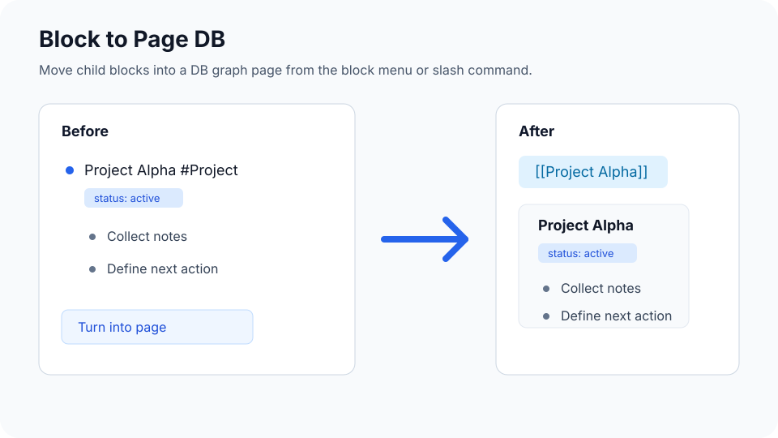

# Block to Page DB

Turn a Logseq block with children into a DB graph page.



## Features

- Adds `Turn Into Page` to the slash command menu.
- Adds `Turn into page` to the block context menu.
- Uses the selected block's first line as the target page name.
- Uses the last page reference in the first line as the target page when page references are present.
- Rewrites a plain first line to a page reference.
- Moves source block properties and tags when a plain first line creates a new page.
- Reuses an existing target page when the target page exists.
- Moves the selected block's children to the end of the target page.
- Expands the source block after children are moved.

## Behavior

### Plain first line

```text
Project Alpha
  Collect notes
  Define next action
```

Creates or reuses `[[Project Alpha]]`, moves the child blocks into that page, and rewrites the source block to:

```text
[[Project Alpha]]
```

When `Project Alpha` is a new page, source block properties and tags move to the page. When `Project Alpha` already exists, page metadata stays unchanged.

### Inline page reference

```text
Task should be done [[Project ABC]]
  Collect notes
  Define next action
```

Uses `[[Project ABC]]` as the target page and keeps the source block text unchanged.

### Multiple page references

```text
Fix [[Issue 123]] for [[Project ABC]]
```

Uses `[[Project ABC]]` as the target page.

## DB Graph Support

This plugin creates an explicit empty anchor block when the target page has no blocks, moves children after that anchor, then removes the anchor. This gives DB graphs a stable move target for empty pages.

## Install Locally

1. Open Logseq.
2. Open `Plugins`.
3. Choose `Load unpacked plugin`.
4. Select the cloned or extracted plugin directory.

After updating this local plugin, unload and load it again from Logseq's Plugins page.

## Development

```sh
npm run check
```

## Release

Create a GitHub tag such as `v0.1.4`. The release workflow builds and uploads:

- `logseq-block-to-page-db.zip`
- `package.json`

Marketplace files live under `marketplace/logseq-block-to-page-db`.

## Credit

Inspired by [hyrijk/logseq-plugin-block-to-page](https://github.com/hyrijk/logseq-plugin-block-to-page).
